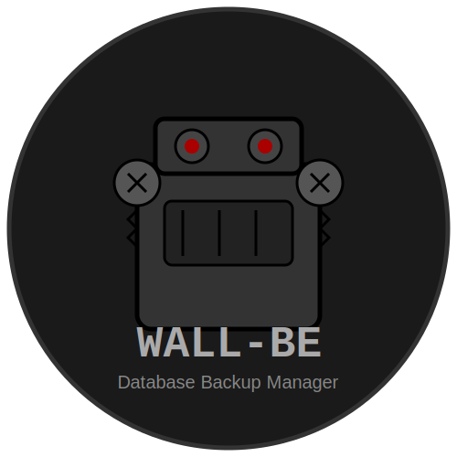

# wall-be

<p align="center">
  
</p>

*Read this in other languages: [English](README.md), [Русский](README.ru.md)*

wall-be - это универсальный инструмент для управления резервными копиями различных баз данных с использованием [WAL-G](https://github.com/wal-g/wal-g).


**Language / Язык**: [English](README.md) | [Русский](README.ru.md)

## Возможности

- Поддержка нескольких баз данных (MySQL, PostgreSQL)
- Простой интерфейс командной строки
- Настраиваемое хранилище резервных копий (S3, GCS, Azure, локальное)
- Планирование через cron
- Управление политиками хранения
- Интеграция с Docker
- Интерактивный демонстрационный режим

## Поддерживаемые базы данных

- [MySQL/MariaDB](docs/databases/mysql.md)
- [PostgreSQL](docs/databases/postgresql.md)

## Документация

- [Начало работы](docs/getting-started.md)
- [Конфигурация](docs/configuration.md)
- [Управление резервными копиями](docs/backup_management.md)
- [Восстановление](docs/restore.md)
- [Планирование резервного копирования](docs/cron.md)
- [Интеграция с Docker](docs/docker.md)
- [Устранение неполадок](docs/troubleshooting.md)

## Установка

Для установки wall-be выполните:

```bash
git clone https://github.com/MushroomSquad/wall-be.git
cd wall-be
chmod +x wall-be.sh
```

Для установки зависимостей можно использовать автоматический скрипт из демонстрационной директории:

```bash
# Установка всех зависимостей
sudo ./demo/setup_dependencies.sh

# Или запустить демонстрационный режим и выбрать пункт "Установка и настройка зависимостей"
./demo/run-demo.sh
```

## Интернационализация

WALL-BE поддерживает многоязычный интерфейс:

- Язык по умолчанию определяется автоматически из настроек системы
- Вы можете переопределить язык с помощью переменной окружения:

```bash
# Принудительно использовать английский язык
WALL_BE_LANG=en ./wall-be.sh mysql backup

# Принудительно использовать русский язык
WALL_BE_LANG=ru ./wall-be.sh mysql backup
```

В настоящее время поддерживаемые языки:
- Английский (en)
- Русский (ru)

## Быстрый старт

### Настройка WAL-G для MySQL

```bash
./wall-be.sh mysql setup
```

Эта команда:
1. Загрузит и установит WAL-G
2. Создаст конфигурационный файл по умолчанию
3. Настроит MySQL для интеграции с WAL-G

### Создание резервной копии MySQL

```bash
./wall-be.sh mysql backup
```

### Просмотр доступных резервных копий

```bash
./wall-be.sh mysql list
```

### Восстановление из резервной копии

```bash
./wall-be.sh mysql restore --name LATEST
```

## Демонстрационный режим

wall-be включает интерактивный демонстрационный режим, позволяющий ознакомиться с возможностями инструмента без влияния на вашу рабочую среду:

```bash
# Запуск демонстрации
./demo/run-demo.sh

# Запуск с указанием языка (en - английский, ru - русский)
DEMO_LANG=ru ./demo/run-demo.sh
```

Демонстрационный режим включает:
- Процесс резервного копирования и восстановления MySQL/MariaDB
- Процесс резервного копирования и восстановления PostgreSQL
- Примеры настройки расписаний резервного копирования
- Настройка политик хранения резервных копий
- Примеры интеграции с Docker
- Набор автоматических тестов

Для демонстрации на основе Docker, не требующей локально установленных баз данных:
```bash
./demo/docker-demo.sh
```

## Вклад в проект

Мы приветствуем ваш вклад! Пожалуйста, ознакомьтесь с нашими [рекомендациями по вкладу](CONTRIBUTING.ru.md).

## Лицензия

Этот проект лицензирован под лицензией MIT.

## Благодарности

- [WAL-G](https://github.com/wal-g/wal-g) - Основной инструмент резервного копирования
- [MySQL](https://www.mysql.com/) - Документация и сообщество базы данных
- [PostgreSQL](https://www.postgresql.org/) - Документация и сообщество базы данных 