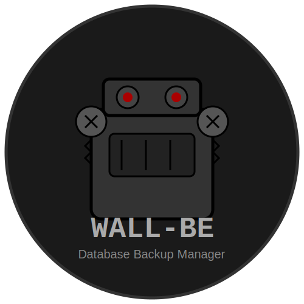

# WALL-BE Documentation

  

Welcome to the WALL-BE documentation. This documentation covers all aspects of setting up, configuring, and using WALL-BE for database backup management.

## Languages

Documentation is available in:
- [English](en/)
- [Russian](ru/)

## Quick Links

- [Getting Started](en/getting-started.md)
- [Configuration](en/configuration.md)
- [Backup Management](en/backup.md)
- [Restore](en/restore.md)
- [Scheduling Backups](en/cron.md)
- [Docker Integration](en/docker.md)
- [Troubleshooting](en/troubleshooting.md)

## Supported Databases

- [MySQL/MariaDB](databases/en/mysql.md)
- [PostgreSQL](databases/en/postgresql.md) 